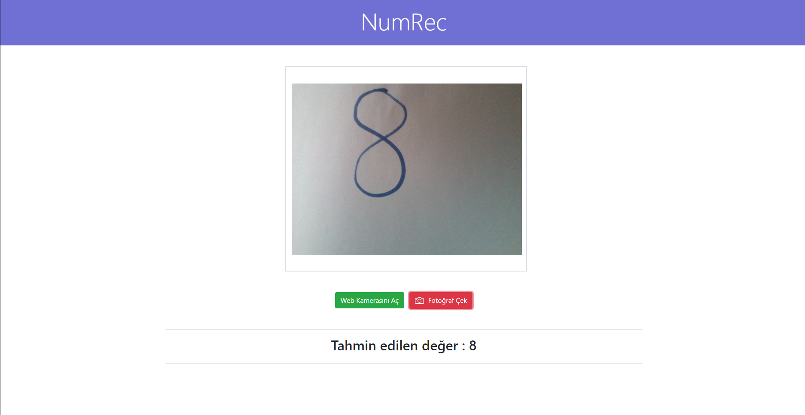

# Number Recognition App


Geliştirilen proje; kullanıcının kağıda el yazısı ile yazmış olduğu rakamları tanıyarak ekrana rakamı yazmaktadır. Projede python ve javascript programlama dilleri kullanılmıştır. Kullanıcı kamerayı açarak geliştirilen flask API' ye istek atar ve sonucu web sayfasında görür.





## Giriş


MNIST  veri seti ile eğitilen derin öğrenme modeli ile kullanıcının kağıt üzerine yazmış olduğu rakamın tahmini işlemi gerçekleştirildi. Python kütüphanelerinden olan Flask ile bir API oluşturularak kullanıcının fotoğrafını base64 formatında alındı ve decode işlemlerinden sonra fotoğraf üzerinde tek kanala çevirme işlemi gerçekleştirildi ve renk değerleri 0 ile 255 arasına dönüştürüldü. Bu sayede fotoğraftaki rakam iyi bir şekilde seçilebilir hale getirildi. Daha sonra h5 uzantılı derin öğrenme modelini içeren dosyadan model çağırıldı ve tahmin (predict) işlemi gerçekleştirildi. Elde edilen tahmin değeri JSON data olarak kullanıcıya geri döndürüldü.


Projeyi kullanmak için yapmanız gereken aşağıda bulunan komutu çalıştırmaktır.

````python
python app.py
````

Daha sonra web sitesine giderek ilk olarak 'Web Kamerasını Aç' butonuna basmalı ve gerekli izinleri vermelisiniz. Bu adımdan sonra kağıdı web kamerasına tutarak 'Fotoğraf Çek' butonuna basmalısınız. Kısa bir süre sonra sonuç aşağıdaki alana yazılacaktır.


## Gereksinimler


````
Python 3.x.x
------------
Tensorflow
Keras
OpenCV
NumPy
Flask
Pillow
base64
````


## Notlar


* Kameraya doğrulttuğunuz kağıdın okunabilir olduğundan emin olun.
* Ortamdaki ışık miktarının yeterli seviyede olmasına dikkat edin. Aksi taktirde kağıt üzerindeki rakam tam olarak okunamayacaktır ve hatalı tahminde bulunacaktır.
* Kağıt üzerine çizmiş olduğunuz rakamı kalın ve okunabilir bir şekilde çizmelisiniz.


## Yazarlar

Emirhan KIRAN - [Emirhan KIRAN](https://www.linkedin.com/in/emir-kiran/)
